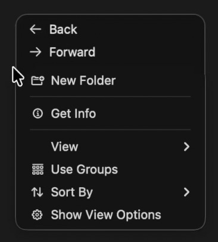
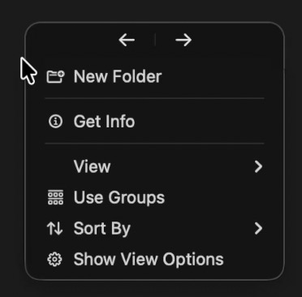
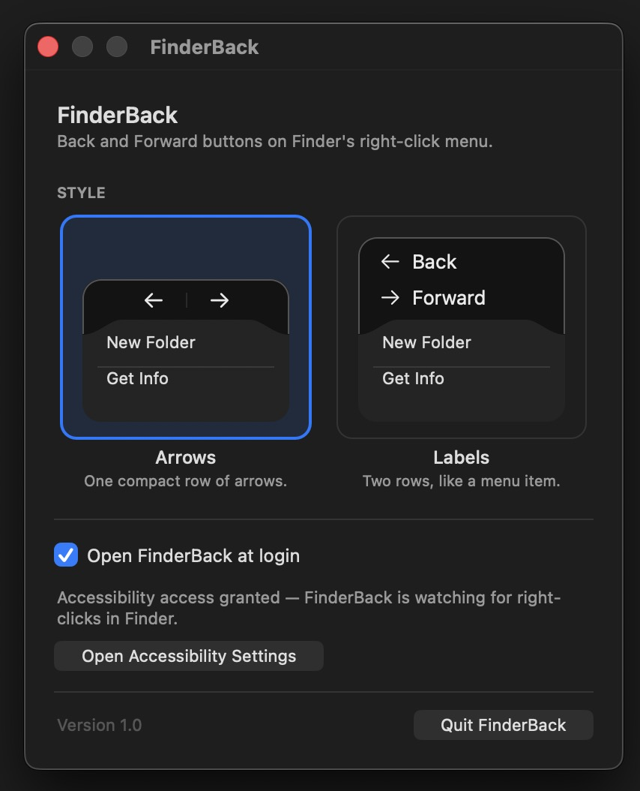

# FinderBack

**Back and Forward, right in Finder’s right-click menu.** Right-click empty space in a Finder window and navigate using a small bar attached to the context menu.

## Get FinderBack — $9.99, one time

**[Buy the ready-to-run Mac app — $9.99 USD](https://finderbackward.lemonsqueezy.com/checkout/buy/e0555cfd-257c-4c38-ba31-ef856bbf1427)**

Download, move the app to Applications, and follow the included first-launch instructions. No developer tools, compiling, subscription, or license-key activation.

- Both styles included: stacked **Back / Forward** labels or compact **← / →** arrows.
- Settings and optional **Open at Login**, available from the menu bar.
- Digital delivery after checkout, with installation instructions and the MIT license.

**The packaged download is for Apple Silicon Macs running macOS 26 or later.** Tested on macOS 26. It is not Developer ID-signed or notarized: macOS normally requires **System Settings → Privacy & Security → Open Anyway** on first launch. You must also enable **Accessibility** for FinderBack.

The paid download saves you compiling the app yourself. The source remains free under the MIT License, with the same features. [Product details and terms](https://finderbac.fdse064.workers.dev/#terms).

## See it in action

[**Watch the demo (52 seconds)**](https://github.com/adfd3ewdf3/FinderBack/raw/refs/heads/main/docs/media/finderback-demo.mov)

| Labels | Arrows |
| :---: | :---: |
|  |  |

Switch styles and enable Open at Login in Settings:



## Install the download

1. [Buy FinderBack](https://finderbackward.lemonsqueezy.com/checkout/buy/e0555cfd-257c-4c38-ba31-ef856bbf1427) and download the ZIP provided after checkout.
2. Unzip it and drag `FinderBack.app` to **Applications**. Quit any older copy first.
3. Open FinderBack. If macOS blocks it, dismiss the alert, then choose **Open Anyway** in **System Settings → Privacy & Security**. Confirm Open when prompted.
4. Enable FinderBack in **System Settings → Privacy & Security → Accessibility**.
5. Right-click empty space inside a Finder window and choose Back or Forward.

FinderBack lives in the menu bar under the two-arrow icon; it has no Dock icon. Use its menu to open Settings or quit. Turn on Open at Login only after moving the app to Applications.

The download includes `START-HERE.txt`, source revision details, and file checksums. After an update, you may need to grant Accessibility again.

## Privacy

FinderBack uses a **listen-only** mouse and keyboard event tap. It cannot swallow, change, or delay your clicks. It reads accessibility roles and the position and size of Finder’s context menu, then sends Finder its Back/Forward shortcuts, **⌘[** and **⌘]**.

It does not read filenames, paths, or your files. It makes no network requests and contains no analytics or crash reporting. Keystrokes are not logged or stored. Style preferences are saved locally using macOS preferences. The source is available here for inspection.

## Build from source

For developers and people who prefer to compile it themselves, the source is free. The build script targets Apple Silicon and macOS 26. Building requires the Xcode Command Line Tools:

```bash
xcode-select --install
git clone https://github.com/adfd3ewdf3/FinderBack.git
cd FinderBack
./build.sh
```

This creates `FinderBack.app` in the project folder. Move it to Applications and enable Accessibility. Each build is ad-hoc signed; rebuilding may require granting Accessibility again.

## Development

```bash
./run.sh                  # run in the foreground
./run.sh --debug          # show event diagnostics
./run.sh --style=arrows   # temporarily use the arrow style
./run-bundle.sh           # launch the app bundle and stream its logs
./kill.sh                 # stop FinderBack
```

Source files are under `Sources/`; visual constants live in `Sources/Config.swift`. See [`ARCHITECTURE.md`](ARCHITECTURE.md) for the architecture and design decisions.

## Known limitations

- Tested on Apple Silicon with macOS 26. The packaged build requires macOS 26 or later and does not support Intel Macs.
- Multi-monitor behavior is unverified.
- The attached navigation bar is always dark.
- Row height does not scale with the system large-text setting.
- The app is not Developer ID-signed or notarized, so macOS normally requires explicit approval on first launch.

## Support and license

[Report a problem or ask a question](https://github.com/adfd3ewdf3/FinderBack/issues). Licensed under [MIT](LICENSE).
